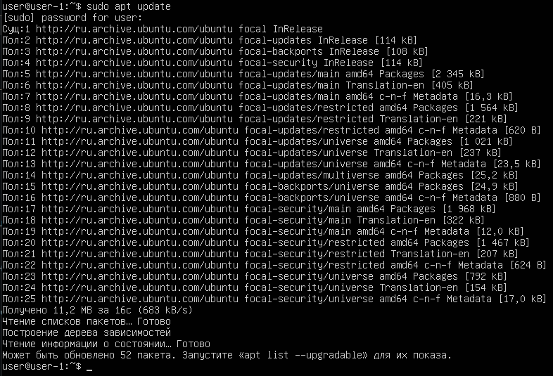
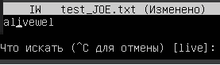
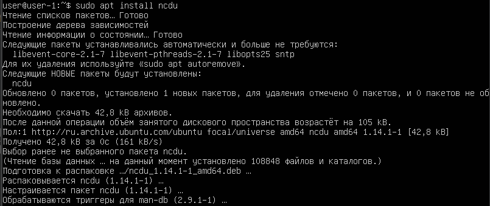

## Part 1. Установка ОС  
* Узнать версию Ubuntu с помощью команды `cat /etc/issue`  
  

## Part 2. Создание пользователя  
* Команда для создания нового пользователя `sudo adduser user2` и добавление его в группу adm `sudo usermod -a -G user2`

  

* Скриншот команды `cat /etc/passwd`  

  

## Part 3. Настройка сети ОС  
1. **Задание названия машины вида user-1, команда:** 

* Задать название машины вида user-1 
`sudo hostname user-1`
* Проверка
`cat /etc/hostname user-1`

  

2. **Установка временной зоны, соответствующей текущему местоположению, команда:**  
`sudo timedatectl set-timezone Europe/Moscow`  

* Результат установки временной зоны  

 

3. **Вывести названия сетевых интерфейсов с помощью консольной команды.** 

* Установка утилиты net-tools `sudo apt install net-tools`

  

* Просмотр сетевой конфигурации `ifconfig` 

* lo (loopback device) – виртуальный интерфейс, присутствующий по умолчанию в любом Linux. Он используется для отладки сетевых программ и запуска серверных приложений на локальной машине. С этим интерфейсом всегда связан адрес 127.0.0.1. У него есть dns-имя – localhost. Посмотреть привязку можно в файле /etc/hosts. 

4. **Используя консольную команду получить ip адрес устройства, на котором вы работаете, от DHCP сервера. Дать расшифровку DHCP.**  
* Сброс старого ip: `sudo dhclient -r enp0s3` 

  

* Получение нового ip: `sudo dhclient -v enp0s3`
* Просмотр сетевой конфигурации `ifconfig`  

 

* Dynamic Host Configuration Protocol (DHCP) — автоматический предоставляет IP адреса и прочие настройки сети (маску сети, шлюз и т.п) компьютерам и различным устройствам в сети.
* Клиент настроенный на получение адреса по протоколу DHCP посылает запрос к серверу, и тот в свою очередь предоставляет свободный IP адрес клиенту во временное пользование — так сказать в аренду (в дальнейшем я буду это так и называть). Срок аренды IP адреса настраивается на сервере. DHCP позволяет значительно уменьшить затраченное время на настройку сети, так же позволяет подключать клиента из одной сети в другую без изменения сетевых параметров. Для провайдеров услуг — DHCP позволяет съэкономить на пуле IP адресов, и присвоить статический IP любому оборудованию.  

5. **Определить и отобразить внешний IP-адрес шлюза (ip) и внутренний IP-адрес шлюза, также известный как IP-адрес по умолчанию (gw).**  
* Узнать свой внешний IP адреса: `wget -O - -q icanhazip.com`

* Получение внутреннего IP адреса: `route -n`  

  

6. **Установить статические (установленные вручную, не полученные от DHCP-сервера) настройки ip, gw, dns (используйте общедоступные DNS-серверы, например, 1.1.1.1 или 8.8.8.8).**  

* Редактирование файла 00-installer-config.yaml для настройки статического IP `sudo nano /etc/netplan/00-installer-config.yaml`
* До редактирования

 

* После редактирования

  

* Применение конфигурации `sudo netplan apply`
* Применение изменений `sudo netplan try`

  

* Просмотр сетевой конфигурации `ifconfig`. Проверка внесений изменений.  

 

7. **Перезагрузить виртуальную машину. Убедиться, что статичные сетевые настройки (ip, gw, dns) соответствуют заданным в предыдущем пункте.**  
* Перезагрузка машины с помощью команды `sudo reboot` и проверил ip машины командой `ip route`  
* Успешная пропинговка с помощью команды `ping ya.ru`.  

   

##   Part 4. Обновление ОС  
**Обновить системные пакеты до последней на момент выполнения задания версии.**  

* Обновление cписка пакетов с помощью команды: `sudo apt update`

* Обновление версии пакетов с помощью команды: `sudo apt dist-upgrade`

* Повторно вводим команду, чтобы убедиться, что обновление не требуется `sudo apt update`

 

## Part 5. Использование команды sudo  
**Разрешить пользователю, созданному в Part 2, выполнять команду sudo.**  
* В папке /etc/sudoers.d создадим файл user2 с помощью команды `sudo touch /etc/sudoers.d/user2` и откроем этот файл через редактор nano с помощью команды `sudo nano /etc/sudoers.d/user2`

* Внесем в этот файл строчку `user2 ALL=(ALL:ALL) ALL`

* Войдем под пользователем с помощью команды `su user2`
* Проверем права пользователя с помощью команды `sudo apt update`

* Команда sudo предоставляет возможность пользователям выполнять команды от имени суперпользователя root, либо других пользователей. Правила, используемые sudo для принятия решения о предоставлении доступа, находятся в файле /etc/sudoers (для редактирования файла можно использовать специальный редактор visudo, запускаемый из командной строки без параметров, в том числе без указания пути к файлу); язык их написания и примеры использования подробно изложены в man sudoers).Имя команды означает substitute user do или super user do. Утилита позволяет запускать программы от имени другого пользователя, но чаще всего от имени корневого. Утилита была разработана еще в 1980 году Бобом Когшелом и Клиффом Спенсером. За это время сменилось много разработчиков и было добавлено много функций.
* Изменим hostname ОС с user-1 на user-2 с помощью команды `sudo nano /etc/hostname`

* Перезагрузим машину для внесения изменений с помощью команды `sudo reboot`

 

##   Part 6. Установка и настройка службы времени  
**Настроить службу автоматической синхронизации времени.**  
* Установка утилиты ntpd c помощью команды `sudo apt install -y ntp`, где -y ответ yes на вопрос установки

* Проверка успешной установки  c помощью команды `dpkg -l | grep "ntp"`

* Обновление списка пакетов `sudo apt update`

* Проверка подключения к серверам синхронизации времени c помощью команды `ntpq -p`

* Остановка ntp c помощью команды `sudo systemctl stop ntp`  
* Принудительная синхронизация времени c помощью команды `sudo ntpd -gq`

* Запуск ntp c помощью команды `sudo systemctl start ntp`  
* Проверка запуска службы c помощью команды `sudo systemctl status ntp`

 

* Проверка синхронизации c помощью команды `timedatectl`

* Синхронизация служба ntp отображается как отсутствующая, но синхронизация по факту должна быть.  
* Для решения этой проблемы необходимо удалить ntp c помощью команды `sudo apt-get purge ntp`  
* Повторная проверка синхронизации c помощью команды `timedatectl`
* На этот раз проверка прошла успешно. 

  

## Part 7. Установка и использование текстовых редакторов  

1. **Используя каждый из трех выбранных редакторов, создайте файл test_X.txt, где X -- название редактора, в котором создан файл. Напишите в нём свой никнейм, закройте файл с сохранением изменений.**  

* Редактирование файла test_VIM.txt  

  

Для выхода с сохранением изменений ввод `:wq` и `Enter`  

* Редактирование файла test_NANO.txt  

 

Для выхода с сохранением изменений нажатие клавиш `Ctrl` + `X` затем `Y` и далее `Enter`  

* Установка текстового редактора JOE 

 

* Редактирование файла test_JOE.txt 

 

Для выхода с сохранением изменений нажатие клавиш `Ctrl` + `K` + `X` (удержание control и последовательное нажатие K и X)  

2. **Используя каждый из трех выбранных редакторов, откройте файл на редактирование, отредактируйте файл, заменив никнейм на строку "21 School 21", закройте файл без сохранения изменений.**  

* Редактирование файла test_VIM.txt 

  

Для выхода без сохранения изменений ввод `:q!` затем нажатие `Enter`  

* Редактирование файла test_NANO.txt

  

Для выхода с сохранением изменений нажатие `Ctrl` + `X` затем `N`  

* Редактирование файла test_JOE.txt  

  

Для выхода с сохранением изменений нажал `Esc` и далее в окне подтверждения выбор `No` нажатием `ENTER`  

3. **Используя каждый из трех выбранных редакторов, отредактируйте файл ещё раз (по аналогии с предыдущим пунктом), а затем освойте функции поиска по содержимому файла (слово) и замены слова на любое другое.**  

* Скриншот из VIM с результатами поиска  

Для поиска в VIM нажимается `/` и вводится искомая строка. Совпадение автоматически выделяется.  

* Скриншот из NANO с результатами поиска

 

Для поиска в NANO нажать `Ctrl` + `W`, затем ввести искомую строку и нажать `Enter`. Курсор переместится к началу совпадения в тексте.

* Скриншот из JOE с результатами поиска 

 

Для поиска в JOE нажать `Ctrl` + `X` затем `F`. После нажать Enter получаем запрос на ввод опций поиска. Нажимаем  Enter снова и курсор переместится к началу совпадения в тексте.

* Скриншот из VIM с командой, введённой для замены фрагмента текста live на WORD 

 

Для замены ввести `:s/live/WORD` 

* Скриншот из NANO с командой, введённой для замены фрагмента текста live на WORD   
Нажимаем `Ctrl` + `\ ` и вводим искомую строку - live   
Затем вводим замену - WORD и нажимаем `Enter` 

     

* Скриншот из JOE с командой, введённой для замены фрагмента текста live на WORD  
Для поиска и замены в JOE нажатие `Ctrl` + `X` затем `F`. Затем вводим искомую строку - live и нажимаем `Enter`. Вводим `R` и нажимаем `Enter`.
Затем вводим замену - WORD и нажимаем `Enter`. Затем вводим замену - WORD и нажимаем `Enter` 

В появившемся окне выбрать "Replace".  

## Part 8. Установка и базовая настройка сервиса SSHD  
1. **Установить службу SSHd.**  
Установка SSH-сервера в системе с помощью команды: `sudo apt-get install openssh-server`  

  

2. **Добавить автостарт службы при загрузке системы.**  
   Для включения автостарта службы воспользуемся командой: `sudo systemctl enable ssh` 

3. **Перенастроить службу SSHd на порт 2022.**  
* Для этого открываем файл конфигурации с помощью команды: `sudo nano /etc/ssh/sshd_config`  
* Находим строку, определяющую порт: Port 22 и заменяем
на 2022, убираем комментирование.  

* Перезапуск службу SSHd с помощью команды `sudo service sshd restart` и проверка статуса службы `sudo service sshd status` 

 

4. **Используя команду ps, показать наличие процесса sshd. Для этого к команде нужно подобрать ключи.**  
* Для этого используется команду `ps -С sshd`  
Результат вывода  

  

* Утилита `ps` (от англ. Process State — «состояние процессов») — это встроенная программа для Unix-подобных операционных систем. Прежде всего, она широко используется при администрировании ОС семейства GNU / Linux. С ее помощью осуществляется мониторинг активных процессов по виртуальным файлам в файловой системе `/proc`.  

**Ключи команды `ps`:**
* `-A`, `-e` - выбрать все процессы  
* `-a` - выбрать все процессы, кроме фоновых  
* `-d` - выбрать все процессы, даже фоновые, кроме процессов сессий  
* `-N` - выбрать все процессы кроме указанных  
* `-С` - выбирать процессы по имени команды  
* `-G` - выбрать процессы по ID группы  
* `-p` - выбрать процессы PID  
* `--ppid` - выбрать процессы по PID родительского процесса  
* `-s` - выбрать процессы по ID сессии  
* `-t` - выбрать процессы по tty  
* `-u` - выбрать процессы пользователя  
* `-x` - найти все вхождения строки поиска  

**Опции форматирования:**  

* `-с` - отображать информацию планировщика  
* `-f` - вывести максимум доступных данных, например, количество потоков  
* `-F` - аналогично `-f`, только выводит ещё больше данных  
* `-l` - длинный формат вывода  
* `-j` - вывести процессы в стиле Jobs, минимум информации  
* `-M` - добавить информацию о безопасности  
* `-o` - позволяет определить свой формат вывода  
* `--sort` - выполнять сортировку по указанной колонке  
* `-L` - отображать потоки процессов в колонках LWP и NLWP  
* `-m` - вывести потоки после процесса  
* `-V` - вывести информацию о версии  
* `-H` - отображать дерево процессов.  
5. Перезапустить систему.  
* Перезапуск системы с помощью команды `sudo reboot`  
* Скачивание утилиты netstat с помощью команды `sudo apt install net-tools`  
* Вывод команды `netstat -tan` 

   

**Объяснение значения ключей -tan, значения каждого столбца вывода, значения 0.0.0.0:**  
* `-t` - Отображение текущего подключения в состоянии переноса нагрузки с процессора на сетевой адаптер при передаче данных.  
* `-a` - Отображение всех подключений и ожидающих портов.  
* `-n` - Отображение адресов и номеров портов в числовом формате.  
* Proto - протокол (tcp, udp, raw), используемый сокетом. TCP/IP — сетевая модель передачи данных, представленных в цифровом виде. Модель описывает способ передачи данных от источника информации к получателю.  
* Recv-Q - счётчик байт не скопированных программой пользователя из этого сокета.  
* Send-Q - счётчик байт, не подтверждённых удалённым узлом.  
* Local Address - адрес и номер порта локального конца сокета.  
* Foreign Address - адрес и номер порта удалённого конца сокета.  
* State - Состояние сокета. LISTEN - Сокет ожидает входящих подключений. ESTABLISHED - Сокет находится в состянии установленного подключения.  
* Адрес 0.0.0.0 означает «любой IP данного компьютера» и включает в себя в том числе 127.0.0.1. Адрес 0.0.0.0 обычно означает, что IP адрес ещё не настроен или не присвоен. Такой адрес указывает хост, который обращается к DHCP для получения IP адреса.  

## Part 9. Установка и использование утилит top, htop  
**Установить и запустить утилиты top и htop.**  
* Запуск утилиты top, команда: `top`

  

* uptime - 2 час 21 минута  
* количество авторизованных пользователей - 1  
* общая загрузка системы - 0, 0, 0. 
* общее количество процессов - 104  
* загрузка cpu - 0%.  
* загрузка памяти - 177MiB.   
* pid процесса занимающего больше всего памяти - 3591  
* pid процесса, занимающего больше всего процессорного времени - 21044  

* Запуск утилиты htop, команда: `htop`  
* Сортировка по PID  

  

* Сортировка по PERCENT_CPU  

  

* Сортировка по PERCENT_MEM 

  

* Сортировка по TIME  

  

* Фильтр для процесса sshd 

  

* Процесс syslog, найденный, используя поиск 

  

* Отображение hostname, clock и uptime

  

## Part 10. Использование утилиты fdisk  
* Запуск команды `sudo fdisk -l`  

  

* Название жёсткого диска: /dev/sda 
* Размер жёсткого диска: 10Gib
* Количество секторов: 20971520 sectors.

* Запуск команды `sudo swapon --show`

* Размер swap: 1,5G

## Part 11. Использование утилиты df  
1. **Запустить команду df.**  
* Запуск утилиты df, команда: `sudo df` 

  

* Размер корневого раздела: 8408452  
* Размер занятого пространства: 4676356  
* Размер свободного пространства: 3283380  
* Процент использования: 59%  
* Единица измерения - Кб.
2. **Запустить команду df -Th.**  
* Запуск команды `sudo df -Th`  

* Размер раздела: 8,1 ГБ  
* Размер занятого пространства: 4,5 ГБ  
* Размер свободного пространства: 3,2 ГБ  
* Процент использования: 59%  
* Тип файловой системы для раздела - ext4. 

## Part 12. Использование утилиты du  
1. **Запустить команду du.**  

2. **Вывести размер папок /home, /var, /var/log (в байтах, в человекочитаемом виде)**  
* Вывод размера папок /home и /var: `sudo du -h -d 0 /home /var`

  

* Вывод размера папки /var/log: `sudo du -h -d 0 /var/log`

 

3. **Вывести размер всего содержимого в /var/log (не общее, а каждого вложенного элемента, используя \*)**  
* Вывод размера всего содержимого папки /var/log: `sudo du -h -d 0 /var/log/*`  

  

## Part 13. Установка и использование утилиты ncdu  
1. **Установить утилиту ncdu.**  
* Команда для установки: `sudo apt install nсdu`

   

2. **Вывести размер папок /home, /var, /var/log.**  
* Вывод размера папки /home: `sudo ncdu /home`

  

* Вывод размера папки /var: `sudo ncdu /var` 

  

* Вывод размера папки /var/log: `sudo ncdu /var/log` 

  

## Part 14. Работа с системными журналами  
* Открыть для просмотра: /var/log/dmesg, команда: `tail /var/log/dmesg`  

  

* Открыть для просмотра: /var/log/syslog, команда: `tail /var/log/syslog`  

  

* Открыть для просмотра: /var/log/auth.log, команда: `tail /var/log/auth.log` 

  

 
* Время последней успешной авторизации: 13:39:52, имя пользователя: user-1, метод входа: LOGIN.
Команда: `sudo grep -ai LOGIN /var/log/auth.log`  

 

* Перезапустить службу SSHd, команда: `sudo service sshd restart`  

* Сообщение о рестарте sshd службы в логе "auth.log", команда: `sudo grep -a restart /var/log/auth.log`  

  

## Part 15. Использование планировщика заданий CRON  
1. **Используя планировщик заданий, запустите команду uptime через каждые 2 минуты.**  
* Cоздание задачи в планировщике заданий с помощью команды `crontab -e`, с выбором текстового редактора по умолчанию.   

  

* Проверка выполнения задания планировщиком заданий с помощью команды: `tail -f /var/log/syslog`  

  

* Удаление добавленного задания из планировщика заданий с помощью команды: `cronetab -e` и редактирование файла. 

  
