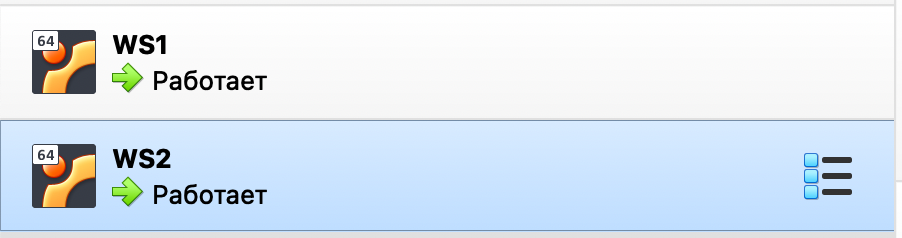
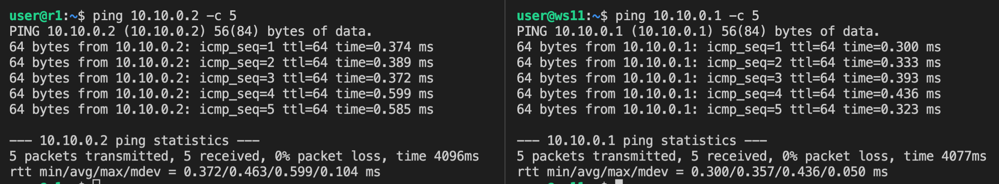
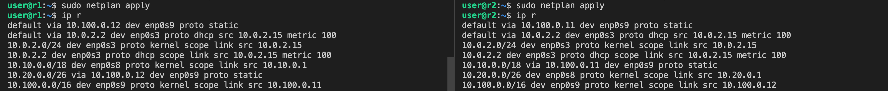
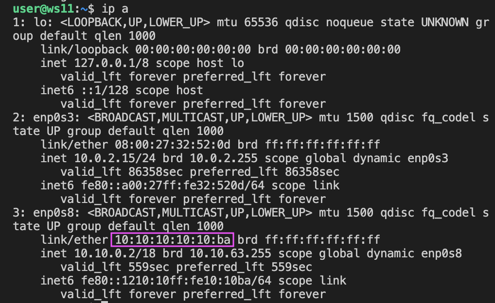
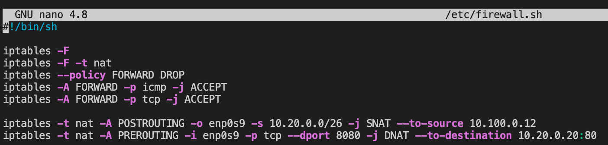

# Сети в Linux

Настройка сетей в Linux на виртуальных машинах.

## Оглавление

   1. [Инструмент ipcalc](#part-1-инструмент-ipcalc)
   2. [Статическая маршрутизация между двумя машинами](#part-2-статическая-маршрутизация-между-двумя-машинами)
   3. [Утилита iperf3](#part-3-утилита-iperf3)
   4. [Сетевой экран](#part-4-сетевой-экран)
   5. [Статическая маршрутизация сети](#part-5-статическая-маршрутизация-сети)
   6. [Динамическая настройка IP с помощью DHCP](#part-6-динамическая-настройка-ip-с-помощью-dhcp)
   7. [NAT](#part-7-nat)
   8. [Допополнительно. Знакомство с SSH Tunnels](#part-8-дополнительно-знакомство-с-ssh-tunnels)

## Отчет

## Part 1. Инструмент **ipcalc**

#### 1.1. Сети и маски

 1) Определим адрес сети 192.167.38.54/13 с помощью команды `ipcalc 192.167.38.54/13`. Перед этим установим утилиту ipcalc с помощью команды `sudo apt install ipcalc`.

 

    Адрес сети - 192.160.0.0/13

 2) Перевод маски 255.255.255.0 в префиксную и двоичную запись, /15 в обычную и двоичную, 11111111.11111111.11111111.11110000 в обычную и префиксную.

* Воспользуемся командой `ipcalc 255.255.255.0`

    Префиксная запись /24
	Двоичная запись - 11111111.11111111.11111111.00000000

* Воспользуемся командой `ipcalc /15`

    Обычная запись - 255.254.0.0
    Двоичная запись - 11111111.11111110.00000000.00000000

* Количество единичек в маске 11111111.11111111.11111111.11110000 - 28шт. Воспользуемся командой `ipcalc 1.1.1.1/28`

    Обычная запись - 255.255.255.240 
	Префиксная запись - /28

 3) Минимальный и максимальный хост в сети 12.167.38.4 при масках: /8, 11111111.11111111.00000000.00000000, 255.255.254.0 и /4

* Воспользуемся командой `ipcalc 12.167.38.4/8`

	Минимальный хост - 12.0.0.1
	Максимальный хост - 12.255.255.254

* Воспользуемся командой `ipcalc 12.167.38.4/16`

	Минимальный хост - 12.167.0.1
	Максимальный хост - 12.167.255.254

* Воспользуемся командой `ipcalc 12.167.38.4/23`

	Минимальный хост - 12.167.38.1
	Максимальный хост - 12.167.39.254

* Воспользуемся командой `ipcalc 12.167.38.4/4`

	Минимальный хост - 0.0.0.1 
	Максимальный хост - 15.255.255.254

#### 1.2. localhost

#### Определить и записать в отчёт, можно ли обратиться к приложению, работающему на localhost, со следующими IP: 194.34.23.100, 127.0.0.2, 127.1.0.1, 128.0.0.1

	194.34.23.100 - нельзя
	127.0.0.2 - можно
	127.1.0.1 - можно
	128.0.0.1 - нельзя

#### 1.3. Диапазоны и сегменты сетей
##### 1) Какие из перечисленных IP можно использовать в качестве публичного, а какие только в качестве частных: *10.0.0.45/8*, *134.43.0.2/16*, *192.168.4.2/16*, *172.20.250.4/12*, *172.0.2.1/12*, *192.172.0.1/12*, *172.68.0.2/12*, *172.16.255.255/12*, *10.10.10.10/8*, *192.169.168.1/16*

    10.0.0.45/8 - частный
    134.43.0.2/16 - публичный
    192.168.4.2/16 - частный
    172.20.250.4/12 - частный
    172.0.2.1/12 - публичный
    192.172.0.1/12 - публичный
    172.68.0.2/12 - публичный
    172.16.255.255/12 - частный
    10.10.10.10/8 - частный
    192.169.168.1/16 - публичный

##### 2) какие из перечисленных IP адресов шлюза возможны у сети *10.10.0.0/18*: *10.0.0.1*, *10.10.0.2*, *10.10.10.10*, *10.10.100.1*, *10.10.1.255*

    10.0.0.1 - невозможен
    10.10.0.2 - возможен
    10.10.10.10 - возможен
    10.10.100.1 - невозможен
    10.10.1.255 - возможен

## Part 2. Статическая маршрутизация между двумя машинами

Поднять две виртуальные машины (далее -- ws1 и ws2)

 

Смотрим существующие сетевые интерфейсы с помощью команды `ip a`:

* ws1  

 

* ws2  

 

Описать сетевой интерфейс, соответствующий внутренней сети, на обеих машинах и задать следующие адреса и маски: 
#### ws1 - 192.168.100.10, маска /16 
#### ws2 - 172.24.116.8, маска /12
* Заходим в VirtualBox и в настройках каждой виртуальной машины (WS1 и WS2) ПКМ - Настроить - Сеть - Адаптер 2. Ставим галочку в строке "Включить сетевой адаптер" и выбираем Тип подключения - Внутренняя сеть.

 

* На обеих машинах выполняем команду `sudo nano /etc/netplan/00-installer-config.yaml` и вносим изменения.
* До внесения изменений  

 

* ws1

  

* ws2  

 

Выполнить команду `sudo netplan apply` и `sudo netplan try` для перезапуска сервиса сети  
* ws1  

  

* ws2  

И проверяем что настройки применились с помощью команды `ip a`:
* ws1  

  

* ws2

 

#### 2.1. Добавление статического маршрута вручную

Добавим статистический маршрут при помощи команды `ip r add` и пропингуем соединение между машинами:

* ws1:
`sudo ip r add 172.24.116.8 dev enp0s8`
* ws2:
`sudo ip r add 192.168.100.10 dev enp0s8`

* ws1:
`ping 172.24.116.8`
* ws2:
`ping 192.168.100.10`

   

#### 2.2. Добавление статического маршрута с сохранением

Добавим статический маршрут от одной машины до другой с помощью файла *etc/netplan/00-installer-config.yaml*, перезапустим сервер сети и пропингуем соединение между машинами:

* ws1:
`ping 172.24.116.8`
* ws2:
`ping 192.168.100.10`

## Part 3. Утилита **iperf3**

#### 3.1. Скорость соединения
##### Перевести и записать в отчёт: 8 Mbps в MB/s, 100 MB/s в Kbps, 1 Gbps в Mbps

- 8 Mbps = 1 MB/s
- 100 MB/s = 819200 Kbps
- 1 Gbps = 1024 Mbps

#### 3.2. Утилита **iperf3**
##### Измерить скорость соединения между ws1 и ws2

Для измерения скорости присвоим WS1 роль клиента с помощью команды iperf3 -c [адрес сервера], а WS2 роль сервера с помощью команды iperf3 -s.

* ws1:
`iperf3 -c 172.24.116.8`
* ws2:
`iperf3 -s`

## Part 4. Сетевой экран

#### 4.1. Утилита **iptables**

Создадим на каждой машине (WS1 и WS2) файл /etc/firewall.sh с помощью команды `sudo nano /etc/firewall.sh`

Добавим правила для ws1 и ws2:

* Входящие пакеты с портов 22 и 80 по протоколу tcp разрешены
* iptables - название утилиты
* -A - указывает на добавление (Append) правила в цепочку INPUT
* -p, протокол - определяет протокол транспортного уровня
* ACCEPT - пропускает пакет, прохождение пакета по цепочке прекращается
* DROP - блокирует пакет, не сообщая источнику об отказе
* --icmp-type - определяет тип ICMP пакета
* echo-reply - эхо-ответ

Запустим правила с помощью команды `sudo chmod +x /etc/firewall.sh` и `sudo /etc/firewall.sh`

В файле для ws1 первым правилом является запрет, а для ws2 разрешение. Правила выполняются сверху-вниз, первое подходящее правило отрабывается, остальные игнорируются. 

#### 4.2. Утилита **nmap**

Пропингуем WS1 c WS2 и WS2 с WS1.

Запустим утилиту nmap.

    
Утилита nmap показывает нам, что оба хоста запущены. Второй хост не пингуется.

## Part 5. Статическая маршрутизация сети

Сеть:

#### 5.1. Настройка адресов машин

В VirtualBox создаем 5 новых виртуальных машин. В настройках всех виртуальных машин включаем внутренюю сеть. 
ПКМ - Настроить - Сеть - Адаптер 2. Ставим галочку в строке "Включить сетевой адаптер" и выбираем Тип подключения - Внутренняя сеть.

В настройках виртуальных машин r1 и r2 дополнительно включаем внутренюю сеть на Адаптере 3.

Вносим настройки в конфигурационные файлы *etc/netplan/00-installer-config.yaml* для каждой машины с помощью команды `sudo nano /etc/netplan/00-installer-config.yaml` и применяем настройки с помощью команды `sudo netplan apply`:

Проверяем настройки сети с помощью команды `ip -4 a`:

Пропингуем r1 c ws11 и наоборот:

Пропингуем ws21 c ws22 и наоборот:

#### 5.2. Включение переадресации IP-адресов

Включим переадресации IP-адресов на роутерах с помощью команды `sudo sysctl -w net.ipv4.ip_forward=1`:

Откроем файл sysctl.conf с помощью команды `sudo nano /etc/sysctl.conf` и раскомментируем строку `net.ipv4.ip_forward = 1`:

#### 5.3. Установка маршрута по умолчанию

Добавим gateway4 [ip роутера] в файлы конфигураций рабочих станций, перезапустим сервис сети и вызовем команду `ip r`:

* ws11 и ws21:

* ws22

* r1 и r2:

Вызовем команду `ip r`:

* ws11 и ws21:

* ws22

* r1 и r2:

Пропингуем с ws11 роутер r2 и покажем на r2, что пинг доходит с помощью команды `tcpdump -tn -i eth1`:

#### 5.4. Добавление статических маршрутов

Добавим в роутеры r1 и r2 статические маршруты в конфигурационные файлы *etc/netplan/00-installer-config.yaml* для каждой машины с помощью команды `sudo nano /etc/netplan/00-installer-config.yaml` и применяем настройки с помощью команды `sudo netplan apply`:

Вызовем команду `ip r` и покажем таблицы с маршрутами на обоих роутерах. 

На ws11 запустим команду `ip r list 10.10.0.0/[маска сети]` и `ip r list 0.0.0.0/0` на ws11:

Для адреса 10.10.0.0/18 был выбран маршрут, отличный от 0.0.0.0/0, поскольку он является адресом сети и доступен без шлюза.

#### 5.5. Построение списка маршрутизаторов

Запускаем одновременно команды `traceroute 10.20.0.10` на ws11 для построения списка маршрутизаторов на пути от ws11 до ws21 и `sudo tcpdump -tnv -i enp0s8` на r1 для отслеживания пакетов.

Расшифровка флагов tcpdump:
#### -t Не отображает метку времени в каждой строке.
#### -n Отображает IP-адрес вместо имени хоста.
#### -v Вывод подробной информации (TTL; ID; общая длина заголовка, а также его параметры; производит проверку контрольных сумм IP и ICMP-заголовков)
#### -i Указывает на то, какой сетевой интерфейс будет использоваться для захвата пакетов. (в нашем случае -i enp0s8)

Для определения промежуточных маршрутизаторов traceroute отправляет целевому узлу серию ICMP-пакетов (по умолчанию 3 пакета), с каждым шагом увеличивая значение поля TTL («время жизни») на 1. Это поле обычно указывает максимальное количество маршрутизаторов, которое может быть пройдено пакетом. Первая серия пакетов отправляется с TTL, равным 1, и поэтому первый же маршрутизатор возвращает обратно ICMP-сообщение «time exceeded in transit», указывающее на невозможность доставки данных. Traceroute фиксирует адрес маршрутизатора, а также время между отправкой пакета и получением ответа (эти сведения выводятся на монитор компьютера). Затем traceroute повторяет отправку серии пакетов, но уже с TTL, равным 2, что заставляет первый маршрутизатор уменьшить TTL пакетов на единицу и направить их ко второму маршрутизатору. Второй маршрутизатор, получив пакеты с TTL=1, так же возвращает «time exceeded in transit».

Процесс повторяется до тех пор, пока пакет не достигнет целевого узла. При получении ответа от этого узла процесс трассировки считается завершённым.

На оконечном хосте IP-датаграмма с TTL = 1 не отбрасывается и не вызывает ICMP-сообщения типа срок истёк, а должна быть отдана приложению. Достижение пункта назначения определяется следующим образом: отсылаемые traceroute датаграммы содержат UDP-пакет с заведомо неиспользуемым номером порта на адресуемом хосте. Номер порта будет равен 33434 + (максимальное количество транзитных участков до узла) — 1. В пункте назначения UDP-модуль, получая подобные датаграммы, возвращает ICMP-сообщения об ошибке «порт недоступен». Таким образом, чтобы узнать о завершении работы, программе traceroute достаточно обнаружить, что поступило ICMP-сообщение об ошибке этого типа

#### 5.6. Использование протокола **ICMP** при маршрутизации

Запуск на r1 перехвата сетевого трафика, проходящего через enp0s9 с помощью команды `sudo tcpdump -n -i enp0s9 icmp` и пинг с ws11 несуществующего IP `ping -c 1 10.30.0.111`:

## Part 6. Динамическая настройка IP с помощью **DHCP**

Для работы интернета в 00-installer-config.yaml закомментируем строчку с gateway4 (он блокирует интернет) и применим настройки с помощью команды `sudo netplan apply`.

Скачаем isc-dhcp-server командой `sudo apt install isc-dhcp-server`.

 
1. Настроим конфигурацию службы DHCP в файле `/etc/dhcp/dhcpd.conf` с помощью команды `sudo nano /etc/dhcp/dhcpd.conf` на машине r2. 
Укажем адрес маршрутизатора по-умолчанию, DNS-сервер и адрес внутренней сети:

2. В файле resolv.conf пропишем `nameserver 8.8.8.8` с помощью команды `sudo nano /etc/resolv.conf` на машине r2:

3. Перезагрузим службу **DHCP** с помощью команды `systemctl restart isc-dhcp-server` на машине r2:

Перезагрузим машину ws21 с помощью команды `sudo reboot` и с помощью команды `ip a` покажем, что она получила адрес:

Пропингуем ws22 с ws21:

4. Настроим конфигурацию cети в файле `etc/netplan/00-installer-config.yaml` с помощью команды `sudo nano /etc/netplan/00-installer-config.yaml` на машине ws11.
Добавим строки: `macaddress: 10:10:10:10:10:BA`, `dhcp4: true`:

5. Аналогичная настройка r1 (с жесткой привязкой к MAC адресу)
Скачаем isc-dhcp-server с помощью команды `sudo apt install isc-dhcp-server`. Перед этим в настройках VirtualBox временно выключим адаптер 2 и адаптер 3, чтобы появился интернет.

Настроим конфигурацию службы DHCP в файле `/etc/dhcp/dhcpd.conf` с помощью команды `sudo nano /etc/dhcp/dhcpd.conf` на машине r1. 
Укажем адрес маршрутизатора по-умолчанию, DNS-сервер и адрес внутренней сети:

В файле resolv.conf пропишем `nameserver 8.8.8.8` с помощью команды `sudo nano /etc/resolv.conf` на машине r1:

Перезагрузим службу **DHCP** с помощью команды `systemctl restart isc-dhcp-server` на машине r1:

Перезагрузим машину ws11 с помощью команды `sudo reboot` и с помощью команды `ip a` покажем, что она получила адрес:

После перезагрузки в настройках VirtualBox на машине ws11 в настройках сети на адаптере 2 пропишем MAC-адрес `1010101010BA`:

IP адрес до обновления:

IP адрес после обновления:

Пропингуем r1 с ws11:

6. Запрос обновления ip адреса с ws21

Узнаем IP до обновления с помощью команды `ip a show enp0s8`:

C помощью команды `sudo dhclient -r enp0s8` освободим текущий адрес интерфейса enp0s8.
C помощью команды `sudo dhclient enp0s8` зададим новый адрес интерфейсу enp0s8.

Узнаем IP после обновления с помощью команды `ip a show enp0s8`:

## Part 7. **NAT**
Скачаем isc-dhcp-server с помощью команды `sudo apt install apache2` на машины ws22 и r1. Перед этим в настройках VirtualBox на машине ws22 временно выключим адаптер 2, чтобы появился интернет. Узнать наличие интернета можно с помощью команды `ping ya.ru`.

1. На машинах ws22 и r1 в файле */etc/apache2/ports.conf* изменим строку `Listen 80` на `Listen 0.0.0.0:80` с помощью команды `sudo nano /etc/apache2/ports.conf`:

2. Запустим веб-сервер Apache с помощью команды `service apache2 start` на машинах ws22 и r1:

3. Создадим на машине r1 файл `/etc/firewall.sh` с помощью команды `sudo nano /etc/firewall.sh`:

Добавление в фаервол на r2 следующих правил:
1) Удаление правил в таблице filter - `iptables -F`
2) Удаление правил в таблице "NAT" - `iptables -F -t nat`
3) Отбрасывать все маршрутизируемые пакеты - `iptables --policy FORWARD DROP`

Добавление правил и запуск фаервола:

Запустим правила с помощью команды `sudo chmod +x /etc/firewall.sh` и `sudo /etc/firewall.sh`:

Пропингуем ws22 с r1 с помощью команды `ping 10.20.0.20`:

4) Разрешим маршрутизацию всех пакетов протокола **ICMP**:
* На машине r2 в файле `/etc/firewall.sh` добавим строчку `iptables -A FORWARD -p icmp -j ACCEPT` с помощью команды `sudo nano /etc/firewall.sh`:

Запустим правила с помощью команды `sudo chmod +x /etc/firewall.sh` и `sudo /etc/firewall.sh`:

Проверка соединения между ws22 и r1 командой ping:

5) Включить **SNAT**, а именно маскирование всех локальных ip из локальной сети, находящейся за r2 (сеть 10.20.0.0)
* На машине r2 в файле `/etc/firewall.sh` добавим строчку `iptables -t nat -A POSTROUTING -o enp0s9 -s 10.20.0.0/26 -j SNAT --to-source 10.100.0.12` с помощью команды `sudo nano /etc/firewall.sh`:

* SNAT, Используется только в цепочке POSTROUTING таблицы nat . Изменяет адрес источника пакета, если он удовлетворяет условиям, и всех последующих пакетов соединения (последние не будут тестироваться).
* -t, --table таблица nat:
Эта таблица используется, когда встречается пакет, устанавливающий новое соединение. Она содержит три предопределённых цепочки: PREROUTING (для изменения входящих пакетов), OUTPUT (для изменения локально сгенерированных пакетов перед их отправлением) и POSTROUTING (для изменения всех исходящих пакетов).
* -o, --out-interface [!] имя
Имя интерфейса, через который отправляется обрабатываемый пакет (только для пакетов входящих в цепочки FORWARD, OUTPUT и POSTROUTING ).
* -s, --source [!] адрес[/маска]
Адрес источника. Адресом может быть сетевое имя, имя хоста (не рекомендуем указывать имена хостов, разрешаемые через запросы к удалённым DNS), диапазон IP-адресов (с маской через слэш) или одиночный IP-адрес.
* --to-source ip1[-ip2][:порт1-порт2]
IP-адрес или диапазон адресов (включительно) источника, а также (необязательно, и только в случае -p tcp или -p udp) диапазон портов. Если последний не указан, то выполняются следующие отображения: порты до 512 будут отображаться в порты до 512; порты от 512 до 1023 включительно - в порты до 1024; остальные - в порты начиная с 1024. По возможности порты будут отображаться сами в себя.

6) Включить **DNAT** на 8080 порт машины r2 и добавить к веб-серверу Apache, запущенному на ws22, доступ извне сети
* На машине r2 в файле `/etc/firewall.sh` добавим строчку `iptables -t nat -A PREROUTING -i enp0s9 -p tcp --dport 8080 -j DNAT --to-destination 10.20.0.20:80` с помощью команды `sudo nano /etc/firewall.sh`.
* DNAT, Применяется только в таблице nat и цепочках PREROUTING , OUTPUT и вызываемых из них цепочках определяемых пользователем. DNAT (Destination Network Address Translation) используется для преобразования адреса места назначения в IP заголовке пакета. Если пакет подпадает под критерий правила, выполняющего DNAT, то этот пакет, и все последующие пакеты из этого же потока, будут подвергнуты преобразованию адреса назначения и переданы на требуемое устройство, хост или сеть.
* -t, --table таблица nat:
Эта таблица используется, когда встречается пакет, устанавливающий новое соединение. Она содержит три предопределённых цепочки: PREROUTING (для изменения входящих пакетов), OUTPUT (для изменения локально сгенерированных пакетов перед их отправлением) и POSTROUTING (для изменения всех исходящих пакетов).
* -i, --in-interface [!] имя
Имя интерфейса, через который должен быть получен обрабатываемый пакет (только для пакетов входящих в цепочки INPUT, FORWARD и PREROUTING ). Использование аргумента "!" перед именем интерфейса инвертирует результат теста. Если имя интерфейса оканчивается на "+", то это означает любой интерфейс, имя которого начинается с указанного имени. Если эта опция опущена, при обработке пакета интерфейс, с которого он был получен, не учитывается.
* --dport [!] порт[:порт]
Порт (или диапазон портов) назначения.
* --to-destination
"[ip-адрес][-ip-адрес][:порт-порт]" Определяет новый целевой IP-адрес, либо диапазон (включительно) IP-адресов и (необязательно) диапазон портов (последнее допустимо только при указании -p tcp или -p udp). Если диапазон портов не указывается, порты не будут меняться. То же самое относится IP-адресов.

* Запустим правила с помощью команды `sudo chmod +x /etc/firewall.sh` и `sudo /etc/firewall.sh`.

Проверка соединения по TCP для **SNAT**, для этого с ws22 подключимся к серверу Apache на r1 с помощью команды `telnet 10.100.0.11 80`:

Проверка соединения по TCP для **DNAT**, для этого с r1 подключимся к серверу Apache на ws22 с помощью команды `telnet 10.100.0.12 8080` (обращаемся к адресу r2):

## Part 8. Дополнительно. Знакомство с **SSH Tunnels**

1. Запуск веб-сервера **Apache** на ws22 только на localhost:
* На машине ws22 откроем файл `/etc/apache2/ports.conf` с помощью команды `sudo nano /etc/apache2/ports.conf`. Изменим строку `Listen 80` на `Listen localhost:80`.
* Запустим веб-сервер Apache с помощью команды `service apache2 start`.

2. Воспользоваться *Local TCP forwarding* с ws21 до ws22, чтобы получить доступ к веб-серверу на ws22 с ws21:

Для *Local TCP forwarding* применяется команда ssh -L local_port:destination:destination_port ssh_server_ip. -L указывает, что соединения с заданным TCP-портом или сокетом Unix на локальном (клиентском) хосте должны перенаправляться на заданный хост и порт или сокет Unix на удаленной стороне. 

На машине ws21 получим доступ к веб-серверу ws22 с помощью команды `ssh -L 4444:localhost:80 10.20.0.20`:

На машине ws21 проверим подключение с помощью команды `telnet 127.0.0.1 4444`:

3. Воспользоваться *Remote TCP forwarding* c ws11 до ws22, чтобы получить доступ к веб-серверу на ws22 с ws11:

Для *Remote TCP forwarding* применяется команда ssh -R remote_port:destination:destination_port ssh_server_ip. -R указывает, что соединения с данным портом TCP или сокетом Unix на удаленном (серверном) хосте должны перенаправляться на локальную сторону.

На машине ws22 получим доступ к веб-серверу ws11 с помощью команды `ssh -R 5555:localhost:80 10.10.0.2`:

На машине ws11 проверим подключение с помощью команды `telnet 127.0.0.1 5555`:

