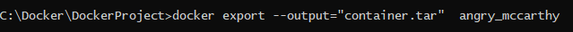
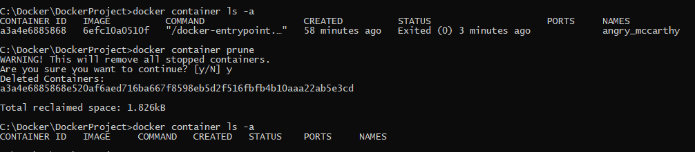
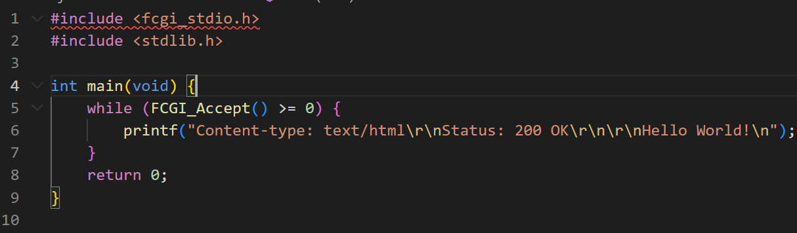

# Simple Docker

## Part 1. Готовый докер

* Взять официальный докер образ с nginx и выкачать его при помощи `docker pull`
  

* Проверить наличие докер образа через `docker images`

* Запустить докер образ через `docker run -d [image_id|repository]`

* Проверить, что образ запустился через `docker ps`

* Посмотреть информацию о контейнере через `docker inspect [container_id]`

* По выводу команды определить и поместить в отчёт размер контейнера, список замапленных портов и ip контейнера:

* размер контейнера

* список замапленных портов

* ip контейнера

* Остановить докер образ через `docker stop [container_name]`

* Проверить, что образ остановился через `docker ps`

* Запустить докер с замапленными портами 80 и 443 на локальную машину через команду run
* `sudo docker run -p 80:80 -p 443:443 -d [image_id]`

* Перезапустить докер контейнер через `docker restart [container_id|container_name]`

* Проверить любым способом, что контейнер запустился

* `docker ps`

## Part 2. Операции с контейнером

* Прочитать конфигурационный файл nginx.conf внутри докер контейнера через команду `exec`

* `docker exec [container_id|container_name] find / -name "nginx.conf"`
* `docker exec [container_id|container_name] cat /etc/nginx/nginx.conf`

* Создать на локальной машине файл nginx.conf

* `docker exec [container_id|container_name] cat /etc/nginx/nginx.conf > nginx.conf`

* Настроить в нем по пути /status отдачу страницы статуса сервера nginx

* Скопировать созданный файл nginx.conf внутрь докер образа через команду docker cp

* `docker cp nginx.conf [container_id|container_name]:/etc/nginx/`

* Перезапустить nginx внутри докер образа через команду exec

* `docker exec [container_id|container_name] nginx -s reload`

* Проверить, что по адресу localhost:80/status отдается страничка со статусом сервера nginx

* Экспортировать контейнер в файл container.tar через команду export

* `docker export --output="container.tar" [container_id|container_name]`

* Остановить контейнер

* `docker stop [container_id|container_name]`

* Удалить образ через `docker rmi [image_id|repository]`, не удаляя перед этим контейнеры

* `docker rmi nginx -f`

* Удалить остановленный контейнер

* `docker container ls -a`
* `docker container prune`

* Импортировать контейнер обратно через команду import

* `docker import container.tar nginx`

* Запустить импортированный контейнер

* `docker run -dit -p 80:80 [image_id] bash`
* `docker ps`
* `docker exec [container_id|container_name] service nginx status`
* `docker exec [container_id|container_name] service nginx start`

## Part 3. Мини веб-сервер

3.1 Создание сервера на языке С

3.2 Создание nginx.conf

3.3 Выкачка докера nginx. Проверка, что загрузка прошла успешно. Запуск образа и проверка, что он запустился

3.4 Копирование nginx.conf и server.c в докер-контейнер

3.5 Вход в сам контейнер. Проверка, что файлы успешно скопировались

3.6 Обновление контейнера. Установка gcc, spawn-dcgi, libfcgi-dev

3.7 Компиляция и запуск нашего сервера

3.8 Перезагрузка контейнера и проверка страницы в браузере

## Part 4. Свой докер

Теперь всё готово. Можно приступать к написанию докер образа для созданного сервера.

**== Задание ==**

*При написании докер образа избегайте множественных вызовов команд RUN*

#### Написать свой докер образ, который:
##### 1) собирает исходники мини сервера на FastCgi из [Части 3](#part-3-мини-веб-сервер)
##### 2) запускает его на 8080 порту
##### 3) копирует внутрь образа написанный *./nginx/nginx.conf*
##### 4) запускает **nginx**.
##### Собрать написанный докер образ через `docker build` при этом указав имя и тег

* `docker build -t box:fox .`

##### Проверить через `docker images`, что все собралось корректно

##### Запустить собранный докер образ с маппингом 81 порта на 80 на локальной машине и маппингом папки *./nginx* внутрь контейнера по адресу, где лежат конфигурационные файлы **nginx**'а (см. [Часть 2](#part-2-операции-с-контейнером))

* `docker run -d --name magicbox -p 80:81 -v /Users/alivewel/DO5_SimpleDocker-1/src/Task_4/nginx/nginx.conf/:/etc/nginx/nginx.conf/ box:fox`

##### Проверить, что по localhost:80 доступна страничка написанного мини сервера

##### Дописать в *./nginx/nginx.conf* проксирование странички */status*, по которой надо отдавать статус сервера **nginx**
##### Перезапустить докер образ
*Если всё сделано верно, то, после сохранения файла и перезапуска контейнера, конфигурационный файл внутри докер образа должен обновиться самостоятельно без лишних действий*
##### Проверить, что теперь по *localhost:80/status* отдается страничка со статусом **nginx**

## Part 5. **Dockle**

После написания образа никогда не будет лишним проверить его на безопасность.

**== Задание ==**

##### Просканировать образ из предыдущего задания через `dockle [image_id|repository]`
##### Исправить образ так, чтобы при проверке через **dockle** не было ошибок и предупреждений

##### Для установки утилиты воспользуемся командой

* `brew install goodwithtech/r/dockle`

##### Чтобы устранить одно из предупреждений утилиты dockle воспользуемся командой

* `export DOCKER_CONTENT_TRUST=1`

##### Для сканирования образа воспользуемся командой

* `dockle -i CIS-DI-0010 box:fox`

##### Сканирование после исправления ошибок

##### Для проверки работоспобности сервера воспользуемся командами

* `docker build -t box:fox .`
* `docker run -d --name magicbox -p 80:81 -v /Users/alivewel/DO5_SimpleDocker-1/src/Task_5/nginx/nginx.conf/:/etc/nginx/nginx.conf/ box:fox`
* `curl localhost:80`
* `curl localhost:80/status`

## Part 6. Базовый **Docker Compose**

Вот вы и закончили вашу разминку. А хотя погодите...
Почему бы не поэкспериментировать с развёртыванием проекта, состоящего сразу из нескольких докер образов?

**== Задание ==**

##### Написать файл *docker-compose.yml*, с помощью которого:
##### 1) Поднять докер контейнер из [Части 5](#part-5-инструмент-dockle) _(он должен работать в локальной сети, т.е. не нужно использовать инструкцию **EXPOSE** и мапить порты на локальную машину)_
##### 2) Поднять докер контейнер с **nginx**, который будет проксировать все запросы с 8080 порта на 81 порт первого контейнера
##### Замапить 8080 порт второго контейнера на 80 порт локальной машины
##### Остановить все запущенные контейнеры
##### Собрать и запустить проект с помощью команд `docker-compose build` и `docker-compose up`

##### Проверить, что в браузере по *localhost:80* отдается написанная вами страничка, как и ранее

##### Для проверки воспользуемся командами
* `curl localhost:80`
* `curl localhost:80/status`

